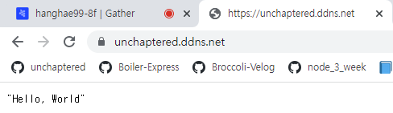

# Express-Nginx-Load-Balance

> - 클론 원본(1) 저장소 : [unchaptered/express-nginx](https://github.com/unchaptered/express-nginx)
> - 클론 원본(1) README : [unchaptered/express-nginx/README.md](./origin/origin_1/README.md)
> - 클론 원본(2) 저장소 : [unchaptered/express-nginx-https](https://github.com/unchaptered/express-nginx-load-balance)
> - 클론 원본(2) README : [unchaptered/express-nginx-https/README.md](./origin/origin_2/README.md)

본 프로젝트는 다음에서 시작되었습니다.

- `2022-08-05` 에 Nginx 를 사용한 Reversy Proxy Server
- `2022-08-06` 에 Nginx 를 사용한 HTTPS Server, 80 -> 443 redirect

추가적으로 구현하고 싶은 부분은 443 포트로 연결 후에 Load Balancing 을 통해서 3001 ~ 3004 포트까지 생성된 Express 앱에 매핑하고 싶었습니다.

3001 ~ 3004 까지 실행 될 Express 앱은 PM2 를 이용 할 생각입니다.

<p align="center"><image src="./Logic.png" style="width: 600px"/></p>

### 결과

1. Nginx 가 80 번 포트에서 listen 한 후 433 포트로 전달
2. Nginx 가 443 번 포트에서 listen 한 후 TSL/SSL 암/복호화를 담당하며 3000, 3001 번 포트로 Load Balancing 실행
3. http(Express) 가 3001, 3002 포트에서 실행



### 주요 사항

1. `/etc/nginx/sites-availalbe/default` 삭제
2. `/etc/nginx/nginx.conf` 수정

```conf
http {

    # 위에 존재 하는 코드들
    # 기존 : include /etc/nginx/sites-enabled/*;

    include /etc/nginx/sites-enabled/도메인-주소;

    # 아래에 존재 하는 코드들

}
```

3. `/etc/nginx/sites-available/도메인-주소` 생성

```conf
upstream my_http_servers {
    server  172.31.39.191:3000;
    server  172.31.39.191:3001;
}

server {

    server_name 도메인-주소;


    listen 443 ssl;
    listen [::]:443 ssl ipv6only=on;
    
    ssl_certificate /etc/letsencrypt/live/도메인-주소/fullchain.pem;
    ssl_certificate_key /etc/letsencrypt/live/도메인-주소/privkey.pem;
    include /etc/letsencrypt/options-ssl-nginx.conf;
    ssl_dhparam /etc/letsencrypt/ssl-dhparams.pem;

    location / {
        proxy_set_header X-Real-IP $remote_addr;
        proxy_set_header Host $http_host;
        proxy_pass https://my_http_servers;
    }

}

server {

    listen 80;
    listen [::]:80;

    server_name 도메인-주소;

    location / {
            return 301 https://도메인-주소$request_uri;
    }

}
```

4. `/home/ubuntu/프로젝트-폴더/app.js` 수정

```javascript
const fs = require('fs');
const https = require('https');
const express = require('express');

const app = express();

app.all('*', (req, res) => res.json('Hello, World'));

const options = {
    cert: fs.readFileSync('PUBLIC 키 경로'),
    key: fs.readFileSync('PRIVATE 키 경로')
};

https.createServer(options, app).listen(3000, 'EC2 Instance Private IPv4',  console.log("Secure server running on port 3000"));
```
